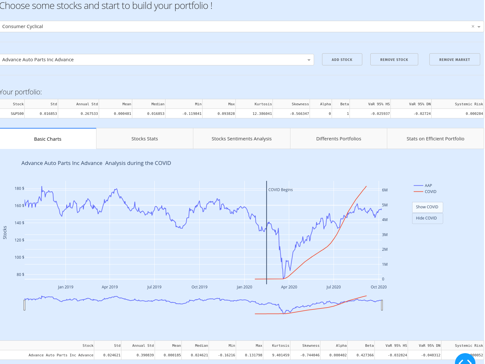
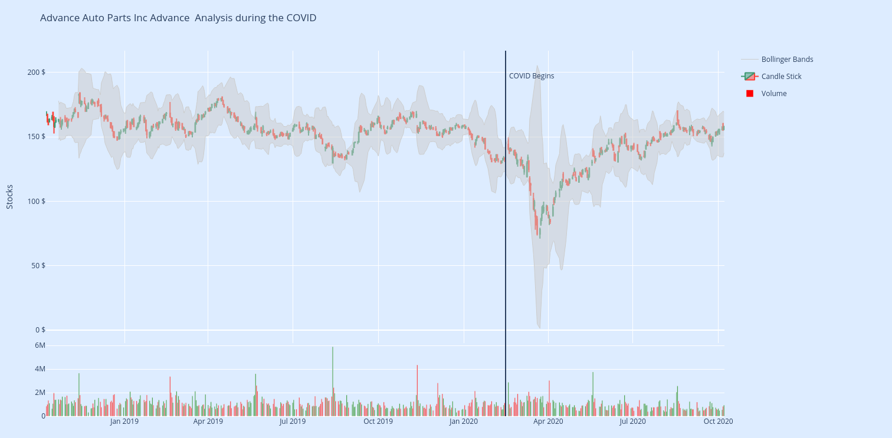
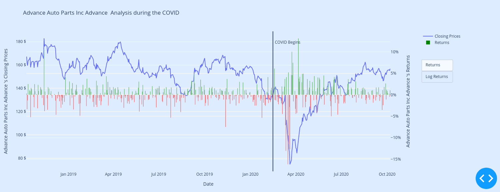
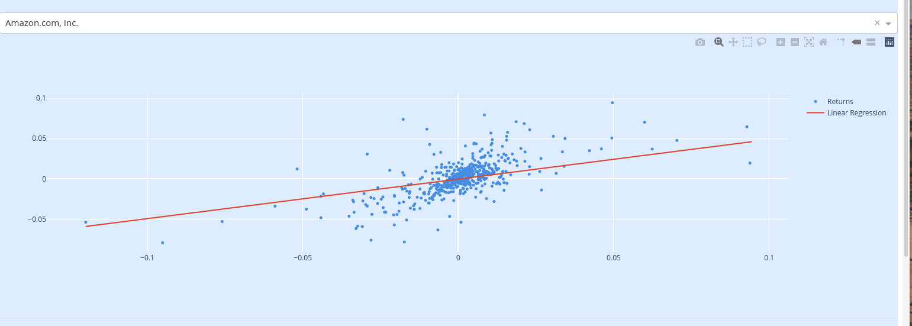
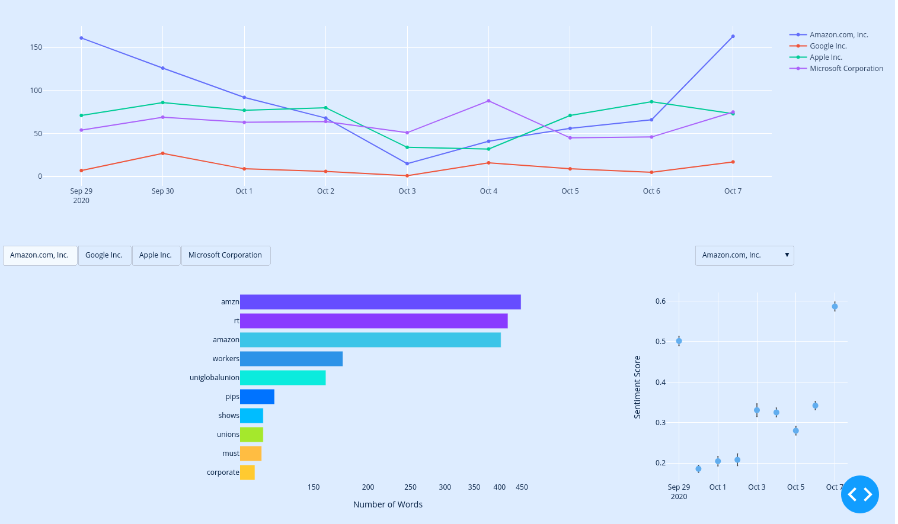
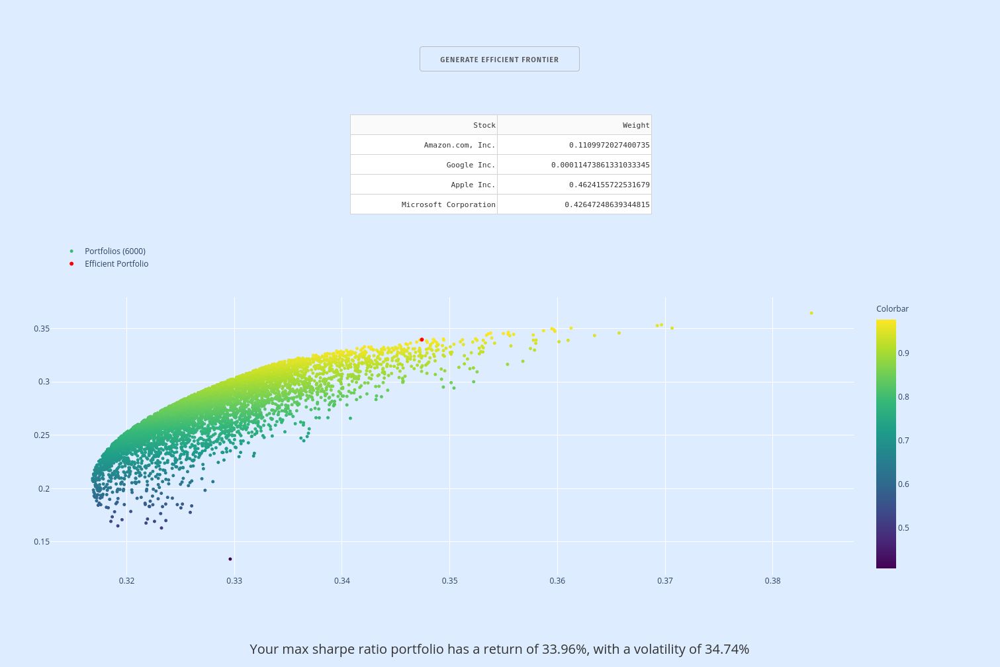
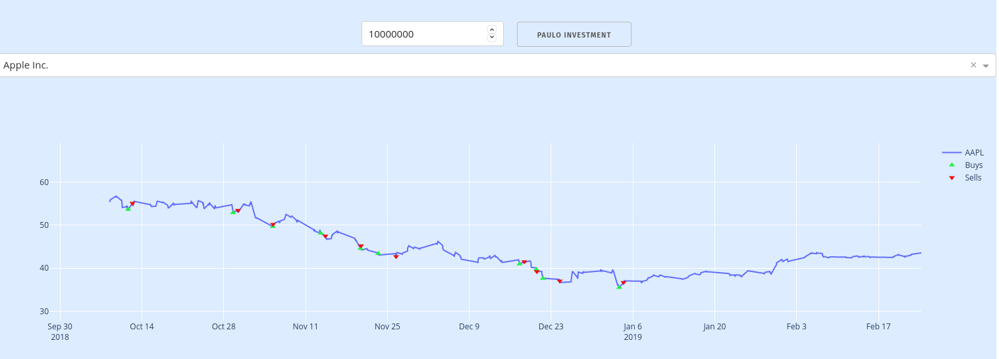
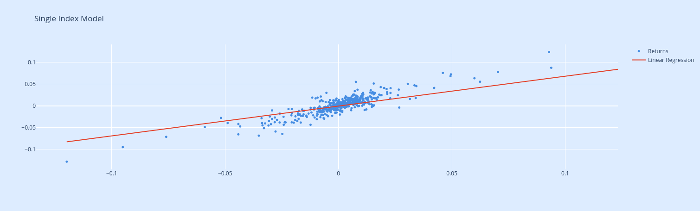

# Financial Dashboard
Here you can find a **Financial Dashboard** realized with *Python*, *Dash* and *Plotly*.  

## ESSAY 1
  Beta version of my dashboard: *https://ancient-citadel-76925.herokuapp.com/*  
  This version has some *bugs* and needs a lot of *improvments*, but this is a good preview of my **first project**.

### Some screenshots of this project
**Home Page**
  
 
  
 
  
 
  
 
**Statistics about Stocks**
  
 
  
 
**Sentiment Analysis with Twitter Data**
  
 
**Simulation of portfolio & Efficient frontier**
  
 
  
 
**Max Sharpe Ratio Portfolio Single Index Model**
  